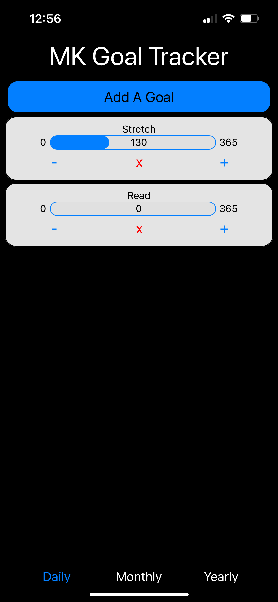
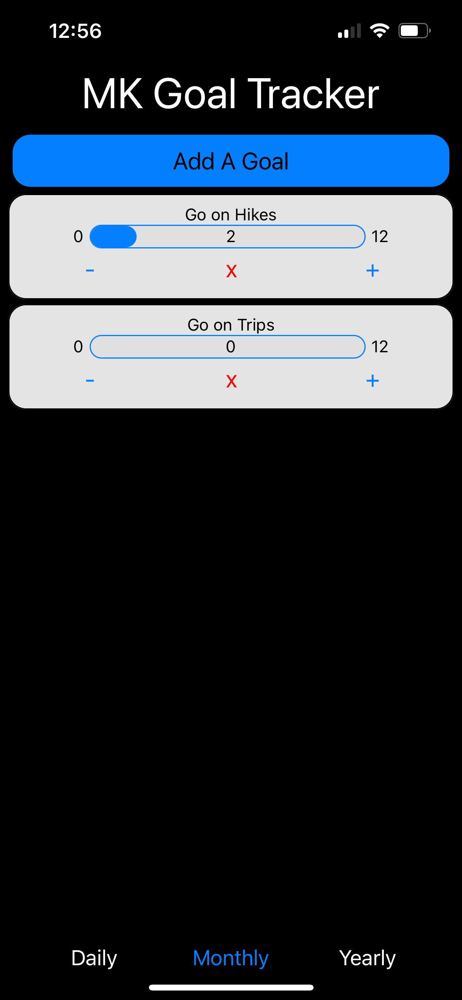
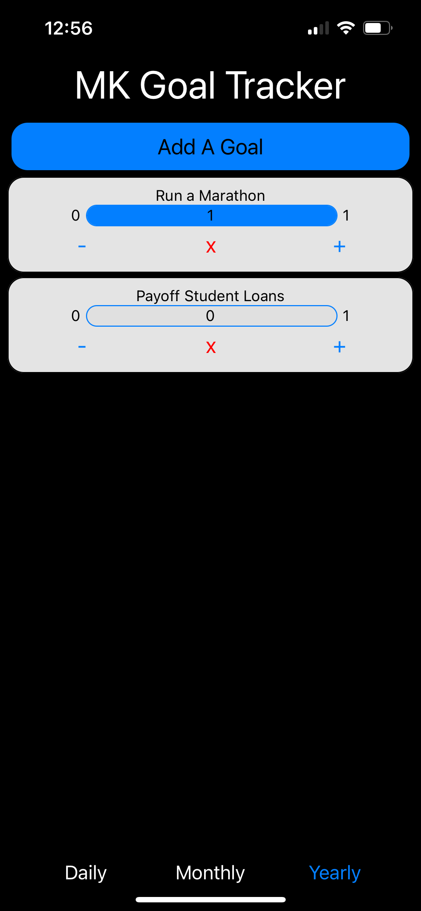
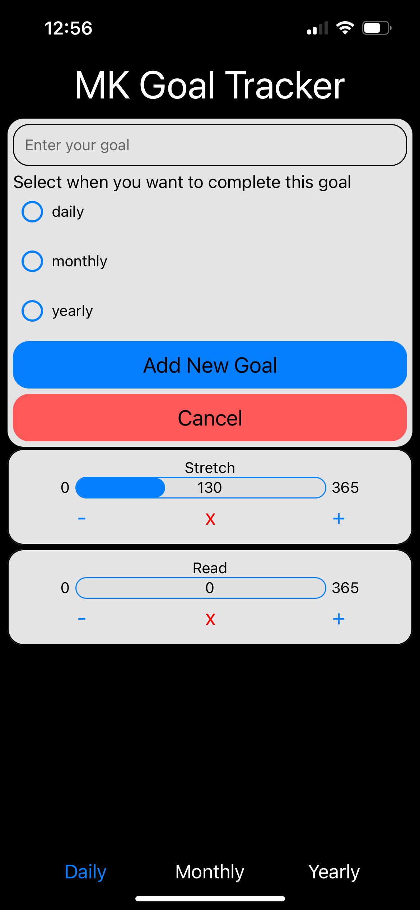

# React Native Goal Tracker

A mobile app that helps users set, track, and achieve their goals.

## Features

- **Goal Setting**: Create and categorize goals based on timeline.
- **Progress Tracking**: View goal progress on a daily, monthly, and yearly basis.
- **Responsive UI**: Designed for a seamless experience on both iOS and Android devices.

## Technologies Used

- **Framework:** React Native
- **State Management:** Redux

## Screenshots

### Daily Goals

### Monthly Goals

### Yearly Goals

### Add Goal Menu

